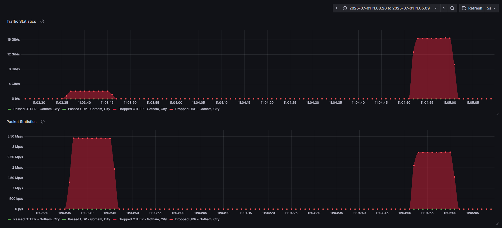

# Bedrock-XDP

Bedrock-XDP is a high-performance **eBPF/XDP Stateless DDoS-mitigation Appfilter** written in Go and C.  
It is laser-focused on protecting Raknet-based game services – especially **Minecraft: Bedrock Edition** (RakNet) – but can be deployed in front of any raknet service that needs lightning-fast packet filtering at the Linux kernel level.

> **Powered by XDP:** packets are inspected *before* they hit the TCP/IP stack – typical mitigation latency is < 1 µs and filtering throughput is measured in **tens of millions of packets per second** on common server hardware.

*Raknet validation is currently stateless... this is open source, If you need a stateful filter contact me.*

Effectively drops all non-raknet traffic targetting protected ports, features ratelimit and global blocklist to enhance DDoS mitigation capabilities


*Please follow the LICENCE accordingly, if you are interested in running this in a comercial enviroment contact me.*

---

## Features

| Category | What it does |
|----------|--------------|
| Traffic classification | • Early drop of non-IPv4 traffic  
• Dedicated counters for **UDP** vs **OTHER** protocols |
| Block- & allow-lists | • *Global* IPv4 blocklist flag  
• Per-service protected bind list (IP/Port or wildcard) |
| Rate limiting | • Per-IP PPS throttle with optional automatic block  
• Map is purged every second |
| Reflection / amplification filters | • AMP source-port detection via configurable port map |
| Protocol sanity | • **RakNet** packet-ID and RakNet magic validation (verifier-safe) |
| Observability | • Console dashboard  
• Prometheus metrics (PPS, BPS, dropped packets, blocked IPs) |


---

## Architecture

```
┌────────────────────────────┐      userspace (Go)
│  analytics/     mitigation/│◀──────────────┐      Prometheus
└────────┬───────────────────┘                │
         │ EBPF maps                          │ scrape / push
         ▼                                    │
┌─────────────────────────────────────────────┐
│                 xdp/xdp.c                   │  < 1 µs
│ (XDP program – able to run in NIC driver)   │
└─────────────────────────────────────────────┘
```

* **Kernel space (`xdp/`)** – ultra-small C program compiled with libbpf.  
  • Maintains consolidated pass/drop counters.  
  • Consults mitigation maps (`protected_map`, `blocklist_map`, …).  
  • Drops or passes packets instantly.

* **User space (`mitigation/`, `analytics/`)** – written in Go using [`cilium/ebpf`](https://github.com/cilium/ebpf).  
  • Loads the XDP object, populates/refreshes maps, flushes blocklists.  
  • Exposes live stats through a colourful console UI and/or Prometheus.

---

## Requirements

* Linux 5.10+ (any distro with eBPF and XDP generic/native support).  
* `clang`/`llvm` + `bpftool` to build the kernel object.  
* Go 1.20+ for the user-space components.  
* Root privileges (needed to attach the program and update maps).

---

## Build & Run

```bash
# Clone repository
$ git clone https://github.com/Upioti/minecraft-bedrock-xdp-ebpf.git && cd minecraft-bedrock-xdp-ebpf

# Build Go binaries (kernel object is embedded, so no Makefile magic needed)
$ go build -o bedrock-xdp ./main

$ clang -g -I/libbpf/src -O2 -target bpf -c ./xdp/xdp.c -o ./xdp/xdp.o

# Edit config.yaml to fit your interface, binds and limits
$ sudo ./bedrock-xdp
```
(Or download from releases tab, compiled on ubuntu)

### Configuration (`config.yaml`)

```yaml
network:
  interface: "bond0" # Interface the Bedrock Filter will run on
  xdpmode: "AUTO" # AUTO, DRV, SKB (GENERIC), NIC
  

prometheus:  #Configuration for prometheus stats
  enabled: true
  bind: "0.0.0.0:9090"
  pop: "Gotham, City" # Point-of-presence label used in Prometheus metrics

protection:
  ratelimit: true # Enable rate limiting
  limit: 300 # Rate limit per ip in packets per second
  block: true # Will add IPs to the blocklist if they surpass the rate limit
  binds:  # Destinations that should go through the Bedrock Filter
    - "1.1.1.1:19132"
    - "2.2.2.2:19132"
    - "0.0.0.0:19132" # To filter EVERYTHING on a specific port use 0.0.0.0

#The blocklist feature will drop all further traffic from an IP after it has sent an invalid raknet packet
blocklist:
  enabled: true # Enable blocklist
  blocktime: 60 # How many seconds to wait before cleaning the blocklist
  global: true # Drop all traffic from blocked IPs regardless of Protocol or Destination
```

---

## Metrics



When Prometheus is enabled the exporter provides these series:

* `passed_pps{pop,protocol}` - Passed packets per second by protocol
* `passed_bps{pop,protocol}` - Passed bits per second by protocol
* `dropped_pps{pop,protocol}` - Dropped packets per second by protocol
* `dropped_bps{pop,protocol}` - Dropped bits per second by protocol
* `blocked_ips_total{pop}` - Number of source IPs currently in blocklist map

Combine them with counters from other nodes for a cluster-wide view.

*BlockedIPs metric is avaliable, currently shows all-time dropped ips, which is unintended, will fix at some point*

---


## Credits

* Built with ❤️ using [**cilium/ebpf**](https://github.com/cilium/ebpf) and the Linux eBPF toolchain.
* Special thanks to @Outfluencer for the inspiration to release a bedrock filter, check out his [MC Java Appfilter](https://github.com/Outfluencer/Minecraft-XDP-eBPF/issues)
* LLMs For making development much faster (Did this in like 3 hours, please dont complain if some modules were edited by AI)


### Check out Papyrus & Arvoris 💙

Need rock-solid anycast and **Active** Layer7 Mitigation for your network?  
Check out **[Papyrus.VIP](https://papyrus.vip/)** – Premium DDoS Protection solutions.  
For a budget-friendly alternative for your small server, visit **[Arvoris](https://arvoris.net/)**.

---

## License

GPL-2.0.  See `LICENSE` file for details. 
